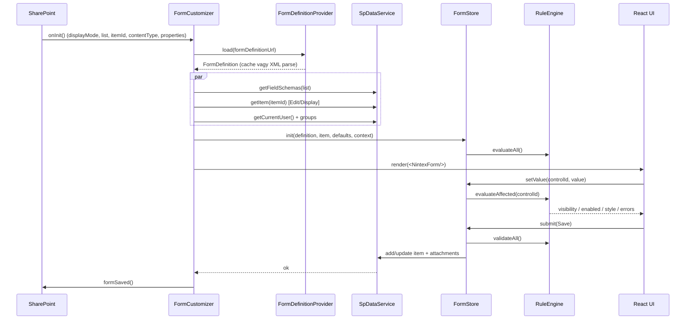

# Rendszerterv – Nintex-alapú SPFx Form Customizer

| | |
|---|---|
| **Projekt** | Legrand forms – Nintex Forms → SPFx Form Customizer |
| **Dokumentum** | Rendszerterv |
| **Verzió** | 0.2 (a megvalósítás során pontosítva, lásd 20. fejezet) |
| **Dátum** | 2026-10-06 |
| **Célplatform** | SharePoint Online, SPFx 1.23.x (vagy a scaffold napján legfrissebb stabil), Node.js 22 LTS |

---

## 1. Cél és hatókör

### 1.1 Cél
Egyetlen, általános (generikus) SPFx **Form Customizer** kiterjesztés készítése, amely a régi (SharePoint on-premises, Nintex Forms 2013/2016 „classic”) űrlapokból **exportált XML definíciók** alapján, futásidőben:

- megjeleníti a lista elem mezőit (New / Edit / Display módban),
- alkalmazza a Nintex űrlap **elrendezését** (pozíció, méret, szín, betű, CSS),
- végrehajtja a **szabályokat** (elrejtés, letiltás, formázás, validáció),
- kiszámolja a **számított mezőket** és **alapértelmezett értékeket**,
- menti az elemet a SharePoint listába.

Az XML-ek a mintafájlok szerint egy-egy lista/tartalomtípus űrlapját írják le (AJForm – Audit jelentés, ATForm – Audit terv, MUForm – Munkautasítás, NyForm – Nyomtatvány, Form – általános dokumentum). **A minták csak példák**: a megoldás nem tartalmazhat XML-specifikus kódot; minden űrlapspecifikus viselkedés az XML-ből és a konfigurációból jön.

### 1.2 Hatókörön belül
- Nintex XML parser (DataContract-sorosított `Nintex.Forms.Form`).
- Kifejezés-nyelv (Nintex formula/rule) értelmező, `eval` nélkül.
- Szabálymotor (Formatting, Validation), InsertReferences kötések.
- Vezérlők: Label, TextBox, MultiLineTextBox (plain/rich), Choice, DateTime, PeoplePicker, SharePointLookup, Attachment, Calculation, Image, Button. Panel (rekurzív `FormControlLayouts`) – a mintákban nincs, de a parser kezelje.
- Abszolút (pixelhű) és reszponzív (keskeny képernyős) elrendezés.
- Mentés PnPjs-sel, mellékletek kezelése.
- Diagnosztikai mód (nem támogatott elemek, árva hivatkozások naplózása).
- Offline elemző szkript (Node), amely a Nintex XML-eket validálja és jelentést készít.

### 1.3 Hatókörön kívül
- Nintex workflow-k, task űrlapok (`Task:Decision` kötés) – figyelmen kívül hagyva.
- Egyedi JavaScript (`<Script>`, `<ScriptUrls>`, `ClientClick`) – biztonsági okból **nem futtatjuk**, csak naplózzuk.
- Nintex Live, Mobile app layoutok (`IsMobileAppLayout=true`) – a parser beolvassa, a renderer a Desktop layoutot használja, keskeny nézetben reszponzív átrendezéssel.
- Repeating Section, List View, SQL Request, Web Request vezérlők – a mintákban nincsenek; a parser „Unsupported” vezérlőként jelöli, helyükön figyelmeztető doboz jelenik meg (csak diagnosztikai módban).

### 1.4 Platform-korlát
A Form Customizer kiterjesztés **csak SharePoint Online**-ban érhető el. A SharePoint Server Subscription Edition csak SPFx 1.0–1.5-öt támogat, Form Customizer (SPFx ≥ 1.15) ott nem használható. A minták on-prem URL-eket tartalmaznak (`appfrlgs243.eu.dir.grpleg.com`, `solutions.grpleg.com`), tehát ez egy **SPO-ra migrációs** forgatókönyv – az URL-eket a konfigurációban át kell írni (lásd 11.3).

---

## 2. Kiinduló helyzet – a minták elemzése

### 2.1 Áttekintés

| Fájl | FormType | Layout (px) | Vezérlő | Szabály | Megjegyzés |
|---|---|---|---|---|---|
| AJForm.xml | ListForm | 700 × 1500 | 51 | 3 (2 Formatting, 1 Validation) | Calculation, PeoplePicker SP-csoport szűréssel, Choice `{ItemProperty:…}` választékkal |
| ATForm.xml | ListForm | 700 × 1500 | 40 | 6 (mind Formatting) | SharePointLookup (multi), Calculation (kötött mező), Disable szabályok |
| Form.xml | ListForm | 700 × 700 | 18 | 1 | Egyszerű dokumentum-űrlap |
| MUForm.xml | Global | 700 × 2000 | 59 | 9 | Custom validation, UserFormVariable, árva vezérlő-hivatkozás |
| NyForm.xml | Global | 700 × 1800 | 55 | 12 | `fn-IsMemberOfGroup` InsertReference, tömeges Disable szabály |

Nintex verzió: `Version` = 101.3.1.10, vezérlők `ControlVersion` 101.2–101.4, illetve 2.2 (Image).

### 2.2 Vezérlőtípusok gyakorisága (5 minta összesen)

| `i:type` | db |
|---|---|
| LabelFormControlProperties | 104 |
| TextBoxFormControlProperties | 29 |
| MultiLineTextBoxFormControlProperties | 23 |
| DateTimeFormControlProperties | 15 |
| PeoplePickerFormControlProperties | 14 |
| ButtonFormControlProperties | 14 |
| ChoiceFormControlProperties | 9 |
| ImageFormControlProperties | 5 |
| AttachmentFormControlProperties | 5 |
| CalculationFormControlProperties | 3 |
| SharePointLookupFormControlProperties | 2 |

### 2.3 Kifejezésekben használt elemek
- **Hivatkozások:** `{ItemProperty:X}` (25), `{Control:<guid>}` (11), `{Common:IsNewMode|IsEditMode|IsDisplayMode|CurrentUser}` (7).
- **Függvények:** `If`, `isDate`, `isNullOrEmpty`, `formatDate`, `toLower`, `length`, `or`, `fn-IsMemberOfGroup`.
- **Operátorok:** `==`, `!=`, `||`, `!`, `+` (szövegösszefűzés).

### 2.4 Talált anomáliák (a motornak tolerálnia kell)
1. **HTML-entitások a kifejezésekben:** `&nbsp;` (pl. `{ItemProperty:Status}&nbsp;== "…"`), duplán kódolt `&amp;lt;típus&amp;gt;` → XML-parse után `&lt;típus&gt;`, ezt még egyszer HTML-dekódolni kell.
2. **Két kifejezés-mező:** `Expression` (HTML `<a reftext=…>` hivatkozásokkal) és `ExpressionValue` (tiszta). **Mindig az `ExpressionValue`-t használjuk**, az `Expression` csak megjelenítési célú.
3. **Árva hivatkozás:** MUForm/NyForm `{Control:291a341c-…}` – nincs ilyen vezérlő az űrlapon. → `null` érték + figyelmeztetés.
4. **Üres szabályok:** üres `ExpressionValue` („New rule 12/13”) vagy üres `ControlIds` (pl. `HideWhenNewMode`) – hatástalanok, diagnosztikában jelezzük.
5. **Átfedő vezérlők:** azonos téglalapon két vezérlő (pl. AJForm `Készítette` PeoplePicker és Calculated Value a 110/630 pozíción), amelyeket szabályok tesznek kölcsönösen láthatóvá. A `ZIndex` és a szabályok határozzák meg a látható réteget.
6. **CSS-szemét:** a `<Css>` blokkban `&nbsp;` karakterek, designer-specifikus (`#uiDesignerSurface`) és IE8-as szabályok.
7. **Rich text címkék:** `LabelFormControlProperties/Text` HTML-t tartalmazhat (`<span style=…>`, `<strong>`).
8. **Furcsa InsertReference:** `DateOnly = {ItemProperty:Created}` – nem logikai tulajdonság; ismeretlen/nem értelmezhető kötésként naplózzuk és figyelmen kívül hagyjuk.
9. **Label ↔ vezérlő kapcsolat:** `AssociatedControl` a vezérlő **`Name`** tulajdonságára hivatkozik (nem UniqueId-re), és lehet `nil`, illetve elírt (pl. `auditPlanID` vs `AuditPlanID`) → kis/nagybetű-független keresés.
10. **Abszolút URL-ek on-prem szerverekre** (Image, banner) → URL-átírás.

---

## 3. Követelmények

### 3.1 Funkcionális követelmények

| ID | Követelmény |
|---|---|
| F-01 | A Form Customizer a tartalomtípushoz rendelt konfiguráció alapján betölti a hozzá tartozó Nintex XML-t. |
| F-02 | Az XML-ből típusos belső modellt (`FormDefinition`) épít. Ismeretlen vezérlőtípus nem okoz hibát. |
| F-03 | New, Edit és Display módban megjeleníti a vezérlőket a Desktop layout szerint. |
| F-04 | Betölti az elem aktuális értékeit (Edit/Display) és az alapértelmezett értékeket (New). |
| F-05 | Kiértékeli a Formatting szabályokat (Hide, Disable, Bold, Italics, Underline, StrikeThrough, Color, BackgroundColor, FontSize, FontType, Align, CssClass) minden releváns változáskor. |
| F-06 | Kiértékeli a Validation szabályokat és a vezérlő-szintű validációkat (kötelező, hossz, típus, regex, tartomány, összehasonlítás, egyedi kifejezés). |
| F-07 | Kiszámolja a Calculation vezérlők értékét (`RecalculateOnNew/Edit/View`). |
| F-08 | Gombok: `Save`, `SaveAndSubmit` → validáció + mentés + `formSaved()`; `Cancel` → `formClosed()`. `VisibleWhenReadOnly`, `ReadOnlyText` kezelése. |
| F-09 | Mentés: New módban minden kötött, nem üres mező; Edit módban csak a módosult (dirty) mezők. |
| F-10 | Mellékletek listázása, feltöltése, törlése (New módban feltöltés az elem létrehozása után). |
| F-11 | PeoplePicker: egy/több érték, SP-csoportra szűkítés (`SharePointGroup`), `AccountType` (User/SecGroup/SPGroup). |
| F-12 | Lookup: forráslista cím (`LookupList`), mező (`LookupField`), egy/több érték. |
| F-13 | Űrlap CSS alkalmazása elszigetelten (scope-olva), a SharePoint oldal többi részének befolyásolása nélkül. |
| F-14 | Keskeny kijelzőn (< konfigurálható töréspont) reszponzív, egyoszlopos megjelenítés. |
| F-15 | Diagnosztikai mód (`?nfDebug=1` vagy konfig): panel a nem támogatott elemekkel, árva hivatkozásokkal, szabály-kiértékelés nyomkövetésével. |
| F-16 | Offline elemző (CLI szkript) XML → JSON modell + kompatibilitási jelentés. |

### 3.2 Nem funkcionális követelmények

| ID | Követelmény |
|---|---|
| NF-01 | SPFx legfrissebb stabil (jelenleg 1.23.x), Node.js 22 LTS, Heft toolchain, React 17 (az SPFx által rögzített verzió – **nem frissíthető**). |
| NF-02 | TypeScript `strict` mód. |
| NF-03 | Nincs `eval`, `new Function`, `innerHTML` szanitizálás nélkül. |
| NF-04 | Első megjelenítés < 1,5 s tipikus űrlapnál (60 vezérlő), XML-cache-sel < 800 ms. |
| NF-05 | Szabály-újraértékelés egy mezőváltozásra < 16 ms (60 vezérlő, 15 szabály). |
| NF-06 | Akadálymentesség: címke–vezérlő összerendelés (`aria-labelledby`), billentyűzetes navigáció, hibaüzenetek `aria-live`-val. |
| NF-07 | Lokalizáció: UI-szövegek (`loc/hu-hu.js`, `loc/en-us.js`), alapértelmezett magyar. |
| NF-08 | Unit teszt lefedettség: parser és kifejezés-motor ≥ 90%, szabálymotor ≥ 80%. |
| NF-09 | Egy XML hibája (parse error) ne törje az oldalt: barátságos hibaüzenet + fallback link az alapértelmezett SharePoint űrlapra. |

---

## 4. Architektúra

### 4.1 Rétegek

```mermaid
flowchart TB
  subgraph SPO[SharePoint Online]
    CT[Tartalomtípus<br/>New/Edit/DisplayFormClientSideComponentId + Properties]
    LIB[(Űrlap-definíciós tár<br/>FormDefinitions/*.xml)]
    LIST[(Céllista + mellékletek)]
  end

  subgraph EXT[SPFx Form Customizer]
    FC[NintexFormFormCustomizer<br/>(belépési pont)]
    CFG[ConfigResolver]
    DEF[FormDefinitionProvider<br/>betöltés + cache]
    PAR[NintexXmlParser]
    MOD[(FormDefinition modell)]
    EXP[Expression engine<br/>Lexer → Parser → AST → Evaluator]
    RUL[RuleEngine]
    STO[FormStore<br/>értékek, dirty, hibák]
    DATA[SpDataService<br/>PnPjs]
    REN[React renderer<br/>FormCanvas + ControlHost + vezérlők]
    CSS[CssScoper + Sanitizer]
  end

  CT --> FC --> CFG --> DEF
  LIB --> DEF --> PAR --> MOD
  MOD --> REN
  MOD --> RUL
  RUL <--> EXP
  STO <--> RUL
  REN <--> STO
  DATA <--> LIST
  STO <--> DATA
  MOD --> CSS --> REN
```

### 4.2 Futási folyamat



### 4.3 Könyvtárszerkezet (cél)

```
nintex-form-customizer/
├─ CLAUDE.md
├─ docs/
│  ├─ Rendszerterv.md
│  └─ Fejlesztoi-leiras.md
├─ samples/                       # Nintex XML minták = teszt fixture-ök
│  ├─ AJForm.xml  ATForm.xml  Form.xml  MUForm.xml  NyForm.xml
├─ scripts/
│  └─ analyze-nintex.ts           # offline elemző (F-16)
├─ config/                        # SPFx konfig (serve.json, package-solution.json, …)
└─ src/
   ├─ extensions/nintexForm/
   │  ├─ NintexFormFormCustomizer.ts
   │  ├─ NintexFormFormCustomizer.manifest.json
   │  └─ loc/ (hu-hu.js, en-us.js, mystrings.d.ts)
   ├─ nintex/                     # platformfüggetlen mag (Node-ban is fut, tesztelhető)
   │  ├─ model/                   # FormDefinition, ControlDefinition, RuleDefinition típusok
   │  ├─ parser/                  # NintexXmlParser, controlParsers/*, normalize.ts
   │  ├─ expression/              # lexer.ts, parser.ts, ast.ts, evaluator.ts, functions/*
   │  ├─ rules/                   # RuleEngine, dependencyGraph.ts
   │  ├─ layout/                  # absoluteLayout.ts, responsiveLayout.ts, collapse.ts
   │  └─ css/                     # cssScoper.ts, cssCleaner.ts
   ├─ services/
   │  ├─ ConfigResolver.ts
   │  ├─ FormDefinitionProvider.ts
   │  ├─ SpDataService.ts         # PnPjs
   │  └─ ValueMapper.ts           # Nintex/form érték ↔ SP REST érték
   ├─ state/
   │  └─ FormStore.ts             # értékek, dirty, hibák, feliratkozás (useSyncExternalStore-szerű)
   └─ components/
      ├─ NintexForm.tsx           # gyökér
      ├─ FormCanvas.tsx           # layout
      ├─ ControlHost.tsx          # pozíció, szabály-stílus, láthatóság
      ├─ DiagnosticsPanel.tsx
      └─ controls/                # LabelControl, TextBoxControl, … (típusonként 1 fájl)
```

**Alapelv:** a `src/nintex/**` mappa **nem függhet** SPFx-től, React-tól és a böngésző DOM-tól → Node alatt Jesttel tesztelhető, és az offline elemző is ezt használja.

---

## 5. Komponensek

### 5.1 `NintexFormFormCustomizer` (belépési pont)
- `BaseFormCustomizer<INintexFormProperties>` leszármazott.
- `onInit()`: PnPjs inicializálás (`spfi().using(SPFx(this.context))`), konfiguráció feloldása, definíció és adatok párhuzamos betöltése.
- `render()`: `ReactDOM.render(<NintexForm …/>, this.domElement)` (React 17).
- `onDispose()`: `ReactDOM.unmountComponentAtNode`.
- Visszahívások a React fa felé: `onSave = () => this.formSaved()`, `onClose = () => this.formClosed()`.

### 5.2 `ConfigResolver`
Forrásai prioritási sorrendben:
1. `ClientSideComponentProperties` (tartalomtípusonként a form customizer tulajdonságai) – **elsődleges**.
2. URL-paraméter felülírás csak fejlesztéshez (`?nfDef=…`, `?nfDebug=1`, `?nfCss=…`), éles környezetben (`DEBUG` build flag nélkül) letiltva. Kivétel a két ártalmatlan megjelenés-kapcsoló (`?nfStyle=nintex|fluent`, `?nfHideImages=0|1`): ezek akkor is működnek, ha a tartalomtípuson `debug: true` van, így a két megjelenés a tenanton összehasonlítható.

```ts
interface INintexFormProperties {
  formDefinitionUrl: string;          // szerver-relatív URL az XML-hez
  layoutName?: string;                // alap: "Desktop"
  responsiveBreakpoint?: number;      // px, alap: 640
  collapseHiddenRows?: boolean;       // alap: true (lásd 10.3)
  urlRewrites?: Record<string, string>; // on-prem → SPO URL előtagok
  emptyRuleBehavior?: "ignore" | "warn"; // alap: "warn" diagnosztikában
  debug?: boolean;
  styleMode?: "fluent" | "nintex";    // alap: "fluent" (lásd 11.4)
  customCssUrl?: string;              // szerver-relatív URL, egyedi CSS (lásd 11.4)
  hideImages?: boolean;               // alap: fluent → true, nintex → false (lásd 10.5)
}
```

### 5.3 `FormDefinitionProvider`
- XML lekérése `GET {formDefinitionUrl}` (PnPjs `getFileByServerRelativePath().getText()`).
- Cache: `sessionStorage` kulcs = `url + ETag` (a fájl `ETag`-je HEAD/`listItemAllFields`-szel), érték = sorosított `FormDefinition` JSON + parser verzió. Parser-verzió-váltáskor érvénytelen.
- **Kódolás:** a Nintex-exportok **UTF-16LE** kódolásúak, többnyire **BOM nélkül** (a fájl `3C 00 3F 00` bájtokkal kezdődik). Ezért a fájlt **bájtként** töltjük le (`getBuffer()`, nem `getText()` – a `Response.text()` UTF-8-ként dekódolna), és a `decodeXmlBytes` BOM, illetve a `<` karakter nulla-bájt mintája alapján választ UTF-8 / UTF-16LE / UTF-16BE között. Az `<?xml … encoding="utf-16"?>` deklarációt dekódolás után eltávolítjuk.

### 5.4 `NintexXmlParser`
- Könyvtár: **`fast-xml-parser`** (böngészőben és Node-ban egyaránt fut), `removeNSPrefix: true`, `ignoreAttributes: false` (az `i:type` és `i:nil` miatt), `isArray` a gyűjteményekre (`FormControlProperties`, `FormControlLayout`, `Rule`, `string`, `KeyValueOfstringstring`, `PeopleEditor.AccountType`).
- `i:nil="true"` → `null`.
- Típusfelismerés: `@_type` attribútum (`d2p1:TextBoxFormControlProperties`) → prefix levágása → `controlParsers[type]`. Másodlagos azonosító: `FormControlTypeUniqueId` (lásd 7. fejezet).
- Normalizálás (`normalize.ts`): `&nbsp;`/U+00A0 → szóköz; HTML-entitás dekódolás a kifejezésekben; GUID-ok kisbetűsítése; számok és bool-ok konvertálása.
- Kimenet: `FormDefinition` (lásd 6.) + `ParseDiagnostics[]`.

### 5.5 Expression engine
Lásd 8. fejezet. Kézzel írt lexer + Pratt-parser + AST-kiértékelő, bővíthető függvénytárral. A kifejezések **egyszer** (parse-kor) AST-vé fordulnak, a függőségek (hivatkozott vezérlők/ItemProperty-k) statikusan kigyűjthetők.

### 5.6 `RuleEngine`
Lásd 9. fejezet. Függőségi gráf alapján csak az érintett szabályokat értékeli újra.

### 5.7 `FormStore`
- Állapot: `values: Map<controlId, FormValue>`, `original: ItemSnapshot`, `dirty: Set<fieldName>`, `ruleState: Map<controlId, ControlRuleState>`, `errors: Map<controlId, string[]>`, `formErrors: string[]`, `submitAttempted: boolean`, `busy`.
- API: `getValue`, `setValue`, `subscribe(controlId, cb)`, `submit(command)`.
- React-oldalon egyedi `useControlState(controlId)` hook → csak az érintett vezérlő renderelődik újra.

### 5.8 `SpDataService` (PnPjs v4)
- `getFields(listId)` – `InternalName`, `TypeAsString`, `ReadOnlyField`, `Required`, `Choices`, `LookupList`, `AllowMultipleValues`, `RichText`, `DisplayFormat`.
- `getItem(listId, itemId, select, expand)` – a definícióban kötött mezők alapján dinamikus `$select`/`$expand` (People/Lookup mezőkhöz `Field/Id,Field/Title,Field/EMail`).
- `addItem`/`updateItem` (`validateUpdateListItem` megfontolandó a szerveroldali validációk miatt – lásd 12.4).
- Mellékletek: `item.attachmentFiles` list/add/delete.
- `getCurrentUser()`, `getCurrentUserGroups()` (a `fn-IsMemberOfGroup`-hoz), `getGroupMembers(group)` (PeoplePicker szűréshez).
- Lookup forrás: `lists.getByTitle(LookupList).items.select("Id", LookupField)` – lapozva, gyorsítótárazva.

### 5.9 `ValueMapper`
Kétirányú leképezés SP REST érték ↔ űrlap-érték ↔ kifejezés-érték, mezőtípusonként (lásd 12.2).

### 5.10 React renderer
- `NintexForm` – gyökér, `FluentProvider`/`ThemeProvider`, hibahatár (`ErrorBoundary`), betöltés-jelző.
- `FormCanvas` – layout kiválasztása (abszolút / reszponzív), magasság-számítás, scope-olt `<style>`.
- `ControlHost` – pozícionálás, `nf-*` CSS-osztályok, szabály-stílusok, `hidden`/`disabled`, hibák megjelenítése.
- `controls/*` – típusonként egy komponens, közös interfész: `IControlProps<TDef> { def, value, onChange, mode, disabled, error, labelId }`.
- UI-készlet: **Fluent UI v8** (`@fluentui/react`, ugyanaz, amit a SharePoint használ) + **PnP SPFx Reusable Controls** (`PeoplePicker`, `RichText`, `DateTimePicker`; a lookuphoz saját Fluent `Dropdown`). A verziót a PnP controls kompatibilitási táblája szerint kell az SPFx verzióhoz igazítani (SPFx 1.23.2 ↔ PnP controls 3.25.0).
- A PnP vezérlők **lusta betöltésűek** (`React.lazy` + `webpackChunkName`, `controls/lazyPnpControls.tsx`): csak akkor töltődnek le, ha egy szerkeszthető People / RichText / időpontos DateTime vezérlő ténylegesen megjelenik. Ok: a PnP controls 3.25 saját Fluent UI 8.106.4-et és PnPjs v2-t hoz magával (az SPFx 1.23 `^8.125`-öt követel meg, így a duplikáció verzió-rögzítéssel nem szüntethető meg) – lásd K-10.

---

## 6. Belső adatmodell

```ts
// src/nintex/model/FormDefinition.ts
export interface FormDefinition {
  id: string;                     // Form/Id
  version: string;                // Form/Version
  formType: "ListForm" | "Global" | string;
  css: string;                    // tisztított, még nem scope-olt
  layouts: LayoutDefinition[];
  controls: Record<string, ControlDefinition>; // UniqueId → def (kisbetűs guid)
  controlsByName: Record<string, string>;      // lower(Name) → UniqueId
  rules: RuleDefinition[];
  variables: FormVariableDefinition[];
  unsupported: { script: boolean; scriptUrls: string[] };
  diagnostics: Diagnostic[];
}

export interface LayoutDefinition {
  name: string;                   // DeviceName/Title, pl. "Desktop"
  width: number; height: number;
  backgroundColor?: string;
  backgroundImageUrl?: string;
  font?: FontStyle;
  items: LayoutItem[];
}

export interface LayoutItem {
  controlId: string;
  left: number; top: number; width: number; height: number; zIndex: number;
  children: LayoutItem[];         // Panel esetén
}

export interface ControlBase {
  id: string; type: ControlType; rawType: string;
  name?: string; displayName?: string;
  cssClass?: string; controlCssClass?: string;
  isVisible: boolean; isEnabled: boolean;
  style: ControlStyle;            // Bold, Italics, FontColor, BackgroundColor, FontSize, FontFamily, HorizontalAlignment, Border*
  helpText?: string;
  bindings: PropertyBinding[];    // InsertReferences → { property, expression(AST) }
}

export interface FieldControlBase extends ControlBase {
  dataField?: { source: "List" | "Task" | string; internalName: string };
  isRequired: boolean;
  requiredErrorMessage?: string;
  controlMode: "Auto" | "Edit" | "Display" | "ReadOnly";
  defaultValue?: ExpressionOrLiteral;
  customValidation?: { expression: Ast; message?: ExpressionOrLiteral };
}

export type ControlDefinition =
  | LabelControl | TextBoxControl | MultiLineTextBoxControl | ChoiceControl
  | DateTimeControl | PeoplePickerControl | LookupControl | AttachmentControl
  | CalculationControl | ImageControl | ButtonControl | PanelControl | UnsupportedControl;

export interface RuleDefinition {
  id: string; title: string;
  type: "Formatting" | "Validation";
  controlIds: string[];
  expression: Ast | null;         // null = üres → hatástalan
  expressionSource: string;       // normalizált ExpressionValue (diagnosztikához)
  hide: boolean; disable: boolean;
  format: Partial<ControlStyle> & { cssClass?: string };
  validationMessage?: string;
}
```

Típusspecifikus mezők (kivonat):

| Típus | Fontos tulajdonságok |
|---|---|
| Label | `text` (HTML lehet), `associatedControlName` |
| TextBox | `dataType` (String/Double/Integer/Currency), `maxLength`, `isPassword`, `regex`, `range`, `compare`, `showAsPercent` |
| MultiLineTextBox | `isRichText`, `richTextMode` (FullHtml/Compatible), `isAppendText` |
| Choice | `choices[]` (kifejezés-tokeneket tartalmazhat), `displayFormat` (DropDownList/ListBox/RadioButtons/CheckBoxes), `fillInChoice`, `multi` (CheckBoxes/ListBox+multi mező), `repeatColumns`, `repeatDirection` |
| DateTime | `dateOnly`, `defaultValueType` (Blank/Today/Expression), `min/max` |
| PeoplePicker | `multiSelect`, `maximumEntities`, `sharePointGroup`, `accountTypes[]` |
| Lookup | `lookupList`, `lookupField`, `lookupWeb`, `allowMultipleValues`, `displayFormat`, `cascade*` |
| Attachment | `min/maxAttachments`, `maxFileSize`, `whitelist`, `blockedExtensions` |
| Calculation | `formula` (AST), `recalculateOn{New,Edit,View}`, `dataType`, `decimals`, `prefix/suffix`, `showAsPercent`, `showThousandSeparator`, opcionális `dataField` |
| Image | `imageUrl`, `alternateText`, `horizontalWidth`, `verticalHeight` |
| Button | `command` (Save/SaveAndSubmit/Cancel/…), `text`, `readOnlyText`, `causesValidation`, `visibleWhenReadOnly`, `enabledWhenReadOnly`, `confirmationMessage`, `showOnRibbon`, `ribbonSequence` |

---

## 7. Nintex → SPFx vezérlő-leképezés

| Nintex típus (`FormControlTypeUniqueId`) | SPFx komponens | SP mezőtípus(ok) | Megjegyzés |
|---|---|---|---|
| Label (`…5e00`) | `LabelControl` (szanitizált HTML) | – | `<label htmlFor>` az `AssociatedControl` alapján |
| TextBox (`…5e05`) | Fluent `TextField` | Text, Number, Currency | `DataType=Double` → számvalidáció, magyar tizedesvessző elfogadása |
| MultiLineTextBox (`…5e06`) | Fluent `TextField multiline` / PnP `RichText` | Note | `IsRichText=true` + `FullHtml` → RichText; Display módban szanitizált HTML |
| Choice (`…5e02`) | `Dropdown` / `ChoiceGroup` / `Checkbox` lista / `ComboBox` (fill-in) | Choice, MultiChoice, Text | `{ItemProperty:…}` választék futásidőben feloldva |
| DateTime (`…5e03`) | PnP `DateTimePicker` / Fluent `DatePicker` | DateTime | `DateOnly`, regionális beállítások (hu-HU) |
| PeoplePicker (`…5e12`) | PnP `PeoplePicker` | User, UserMulti | `groupName` = `SharePointGroup`, `principalTypes` |
| SharePointLookup (`…5e15`) | `Dropdown`/`ComboBox` (multi) saját adatforrással vagy PnP `ListItemPicker` | Lookup, LookupMulti | listacím alapján feloldás |
| Attachment (`5f8b447a-…`) | saját `AttachmentsControl` (Fluent) | Attachments | új elemnél feltöltés mentés után |
| Calculation (`…5e17`) | `CalculationControl` (csak olvasható szöveg) | – / kötött mező | |
| Image (`…5e08`) | `` URL-átírással | – | |
| Button (`…5e09`) | Fluent `PrimaryButton`/`DefaultButton` | – | Save/SaveAndSubmit = elsődleges |
| Panel | `PanelControl` (rekurzív) | – | gyerek layoutok |
| Egyéb | `UnsupportedControl` | – | csak diagnosztikai módban látható |

---

## 8. Kifejezés-nyelv

### 8.1 Előfeldolgozás
1. Forrás: `ExpressionValue` (szabály), `Formula` (Calculation), `DefaultValue`, `CustomValidationFunction`, `CustomErrorMessage`, `InsertReferences/Value`, `Choices/string`.
2. HTML-entitás dekódolás (egyszer, az XML-parse után) → `&lt;` → `<`.
3. ` ` → szóköz.
4. **Literál vs kifejezés:** `DefaultValue`, `Choices`, `CustomErrorMessage` értéke lehet sima szöveg (pl. `Készítés alatt`). A megvalósított algoritmus (`expression/valueSource.ts`):
   1. ha nincs benne `{Névtér:Név}` token és `ident(` minta → **literál**;
   2. ha kifejezésként hibátlanul elemezhető → **kifejezés** (pl. `{ItemProperty:AuditOrg}`, `If(…)`);
   3. ha tokent tartalmaz, de nem elemezhető (szöveg + token keveréke) → **szöveg-sablon** (a tokenek szövegként helyettesítődnek);
   4. egyébként literál (pl. `Megjegyzés (Notes)`).
   Az `InsertReferences` kötések értéke ezzel szemben elsődlegesen **kifejezés**: ami elemezhető, az kifejezés (így `"x"` a szöveg x, `true` logikai érték), és csak a nem elemezhető szöveg esik vissza a fenti osztályozásra.

### 8.2 Nyelvtan (EBNF)

```
expr        := ternaryless_or
or          := and ( "||" and )*
and         := equality ( "&&" equality )*
equality    := relational ( ("==" | "!=") relational )*
relational  := additive ( ("<" | ">" | "<=" | ">=") additive )*
additive    := multiplicative ( ("+" | "-") multiplicative )*
multiplicative := unary ( ("*" | "/" | "%") unary )*
unary       := ("!" | "-") unary | primary
primary     := NUMBER | STRING | "true" | "false" | reference | call | "(" expr ")"
reference   := "{" NAMESPACE ":" NAME "}"          // Common, ItemProperty, Control, Self, WorkflowVariable…
call        := IDENT "(" [ expr ( "," expr )* ] ")" // IDENT tartalmazhat "-"-t: fn-IsMemberOfGroup
STRING      := '"' … '"'  | "'" … "'"
```

### 8.3 Hivatkozások szemantikája

| Hivatkozás | Érték |
|---|---|
| `{Common:IsNewMode}` / `IsEditMode` / `IsDisplayMode` | bool a `displayMode` alapján |
| `{Common:CurrentUser}` | aktuális felhasználó (People érték; szövegként: login/e-mail) |
| `{Common:CurrentDate}`, `{Common:Today}`… | aktuális dátum (bővítés) |
| `{ItemProperty:X}` | **az elem betöltéskori (mentett) értéke** az `X` belső nevű mezőből; New módban üres (`""`) |
| `{Control:<guid>}` | a vezérlő **aktuális** űrlap-értéke (élőben változik) |
| `{Control:<guid>}` ismeretlen guid | `null` + `Diagnostic(OrphanReference)` |
| `{Self}` | a szabállyal érintett vezérlő aktuális értéke (Nintex-kompatibilitás) |

Fontos: az `ItemProperty` hivatkozás **nem** reagál a felhasználói módosításra – ez a Nintex viselkedése, és a mintákban erre épülnek a szabályok (pl. `{ItemProperty:Status}=="Érvényes"` → letiltás a mentett állapot alapján).

### 8.4 Típusok és összehasonlítás
- Értéktípusok: `string | number | boolean | Date | null | Person[] | LookupValue[] | string[]`.
- `==`/`!=`: ha az egyik oldal string, a másikat stringgé alakítjuk (People → megjelenített név/login, Lookup → érték szövege, tömb → `;`-vel összefűzve). `null == ""` → **igaz** (Nintex: üres mező egyenlő az üres stringgel).
- `+`: ha bármelyik string → összefűzés; különben számösszeadás.
- Logikai kontextusban: `""`, `null`, `0`, `false`, üres tömb → hamis.
- Összehasonlítás kis/nagybetű-érzékeny (Nintex-egyezés); a függvények nevei **nem**.

### 8.5 Függvénytár (első kör)

| Függvény | Leírás |
|---|---|
| `If(c, a, b)` | lusta kiértékelés |
| `and(...)`, `or(...)`, `not(x)` | logikai |
| `isNullOrEmpty(x)` | null, "", üres tömb |
| `isDate(x)` | érvényes dátum-e |
| `length(x)` | string hossza / tömb elemszáma |
| `toLower`, `toUpper`, `trim`, `contains`, `startsWith`, `endsWith`, `replace`, `substring` | szöveg |
| `formatDate(d, fmt)` | .NET-stílusú formátum (`yyyy`, `MM`, `dd`, `HH`, `mm`) |
| `dateDiffDays(a, b)`, `addDays(d, n)` | dátum |
| `sum`, `round`, `min`, `max` | szám |
| `fn-IsMemberOfGroup("Csoport")` | a felhasználó tagja-e az SP-csoportnak (előtöltött csoportlistából, szinkron) |
| `userProfileLookup`… | **nem támogatott** → diagnosztika |

Bővítés: `functions/registry.ts`-ben `registerFunction(name, impl, { pure, lazy })`. Az aszinkron adatigényű függvények (csoporttagság, felhasználó) adatait a betöltéskor előtöltjük, így a kiértékelés mindig szinkron.

### 8.6 Hibakezelés
Parse-hiba esetén a kifejezés `ErrorNode` lesz: szabályban **hamisnak** számít (nem rejt el, nem tilt le, nem validál), calculationben üres szöveget ad, és diagnosztikai bejegyzést készít.

---

## 9. Szabálymotor

### 9.1 Állapot vezérlőnként

```ts
interface ControlRuleState {
  hidden: boolean;        // statikus !IsVisible  ||  bármely Hide-szabály igaz  ||  binding(IsVisible)=false
  disabled: boolean;      // statikus !IsEnabled  ||  bármely Disable-szabály igaz  ||  Display mód  ||  ControlMode=ReadOnly/Display  ||  binding(IsEnabled)=false
  style: Partial<ControlStyle>; // igaz Formatting szabályok formázásai, XML-sorrendben, az utolsó nyer
  cssClasses: string[];
}
```

### 9.2 Kiértékelés
- **Formatting:** ha a kifejezés igaz → `Hide`/`Disable`/formázás alkalmazása a `ControlIds` összes vezérlőjére. Több szabály esetén a `hidden` és `disabled` **VAGY**-kapcsolat.
- **Validation:** ha a kifejezés **igaz → hiba** (`ValidationMessage`). A hiba a `ControlIds` vezérlőinél jelenik meg; ha `ControlIds` üres → űrlap-szintű hibaként a gombok felett.
- Üres `ExpressionValue` vagy üres `ControlIds` → szabály kihagyva, diagnosztika (`EmptyRule`).
- Display módban a Validation szabályok nem futnak.
- **Pontosítás (üres `ControlIds`):** Formatting szabálynál az üres `ControlIds` hatástalan (`EmptyRule`); Validation szabálynál viszont **űrlap-szintű validáció** (a hiba a gombok felett jelenik meg). Ez feloldja a fenti két pont közti ellentmondást. Élő (mezőnkénti) újravalidáláskor az űrlap-szintű szabályok nem futnak, csak mentéskor.

### 9.3 Függőségi gráf
Parse-kor minden szabály/formula AST-jéből kigyűjtjük a `Control:` hivatkozásokat. `setValue(controlId)` után csak azok a szabályok és Calculation vezérlők futnak újra, amelyek közvetve/közvetlenül függnek tőle (topologikus sorrend; körkörös függés esetén legfeljebb 10 iteráció, majd diagnosztika).

### 9.4 Vezérlő-szintű validáció
Sorrend: kötelező → adattípus → hossz → regex → tartomány → összehasonlítás → `CustomValidationFunction`. **Rejtett vagy letiltott** vezérlőt nem validálunk (Nintex-viselkedés). A hibák `submitAttempted` után élőben frissülnek.

> **Nyitott kérdés (K-03):** A `CustomValidationFunction` a MUForm-ban kifejezés (`{ItemProperty:TypeofDoc}=="<típus>"`). A Nintex-ben ez régebben JS-függvénynév volt, újabban kifejezés. A mintában a feltétel „hibás állapotot” ír le, ezért a tervezett szemantika: **igaz → hiba** (a Validation szabályokkal egyezően). Éles Nintex-űrlapon ellenőrizni kell.

---

## 10. Elrendezés (layout)

### 10.1 Abszolút mód (alapértelmezett, ≥ töréspont)
- Konténer: `position: relative; width: {layout.width}px; height: számított`, középre igazítva, `background-color = layout.BackgroundColor`.
- Elemek: `position: absolute; left; top; width; height; z-index`.
- Ha a rendelkezésre álló szélesség kisebb, de a töréspont felett van: arányos skálázás `transform: scale()` helyett **százalékos `left/width`** és pixeles `top` – így a szöveg nem zsugorodik.
- A `CanResizeAtRuntime=true` vezérlők (Multiline, Choice, PeoplePicker) magassága nőhet; ilyenkor a vezérlő alatti sorok lefelé tolódnak (lásd 10.3).

### 10.2 Reszponzív mód (< töréspont, alap 640px)
- Elemek rendezése `(top, left)` szerint, sávokba csoportosítva (azonos függőleges sávban lévő elemek egy sor).
- Egy sorban a `label` + `input` párok egymás alá kerülnek, teljes szélességben; dekoratív elemek (Image, szekciócímke) teljes szélességűek.

### 10.3 Sávösszecsukás (`collapseHiddenRows`)
A Nintex classic nem zárja össze a rejtett vezérlők helyét, ami a migrált űrlapokon üres foltokat hagy. Opcionális algoritmus:
1. A vezérlőket függőleges intervallumaik alapján **sávokra** bontjuk (átfedő `[top, top+height)` intervallumok uniója).
2. Ha egy sáv **minden** vezérlője rejtett → a sáv magasságával feljebb toljuk az összes alatta lévő elemet.
3. Ha egy sávban egy elem a futásidőben megnőtt → a különbséggel lejjebb toljuk az alatta lévőket.
4. A háttér-téglalapok (pl. AJForm 890–1185 közötti zöld címke, `ZIndex` < 100, sok elemet lefed) **nem** számítanak a sávképzésbe, ha legalább 2 másik elemet teljesen lefednek; magasságuk a lefedett elemek elmozdulásával együtt változik.

### 10.4 Rétegzés
Az XML `ZIndex` értékeit megtartjuk; az azonos helyen lévő, szabályokkal váltott vezérlők közül a rejtett nem kap `pointer-events`-et.

### 10.5 Konfigurációval eltávolított vezérlők (`hideImages`)
A mintákban minden űrlap tetején egy fejléckép (Image vezérlő, 140–250 px magas) van, amely SPO-ban többnyire nem kell (és a régi on-prem URL-en nem is érhető el). `hideImages: true` esetén:
1. Az **Image** vezérlők és a layout háttérképe (`BackgroundImageUrl`) nem jelenik meg.
2. Az eltávolított elemek helye **mindig** összecsukódik, a `collapseHiddenRows` beállítástól függetlenül (ez nem szabály szerinti, futás közben változó rejtés, hanem végleges elhagyás).
3. Ha egy sávban az eltávolított elem mellett más elem is van (ATForm: a 130–155 közötti számított mező rálóg a 0–155 közötti képre), a sáv a megmaradt elemek kiterjedésére zsugorodik: a számított mező a vászon tetejére kerül.
4. Eltávolított elem nem lehet háttér-téglalap (10.3/4).

Alapértelmezés: `styleMode: "fluent"` mellett `true`, `"nintex"` mellett `false`; külön megadva bármelyik módban felülírható.

---

## 11. Stílus és megjelenés

### 11.1 Űrlap CSS
1. `CssCleaner`: `&nbsp;`/U+00A0 törlése, `#uiDesignerSurface` és IE-specifikus szabályok elhagyása, `@import` és `expression()` tiltása.
2. `CssScoper`: minden szelektor elé `.nf-root-{formId}` prefix (egyszerű CSS-tokenizálóval; `@media` blokkokon belül is).
3. Beépített `nintex-base.module.scss`: a Nintex alap `nf-*` osztályainak (nf-form-label, nf-form-input, nf-section, nf-filler-control-inner, nf-button…) közelítő újraimplementálása, hogy az export nélküli alapértelmezések is egyezzenek.

### 11.2 Vezérlő-stílus
`BackgroundColor`, `FontColor`, `FontFamily`, `FontSize`, `Bold`, `Italics`, `Underline`, `StrikeThrough`, `HorizontalAlignment`, `Border` (`LinePosition=Top` → csak felső keret, `BorderColor`, `BorderWidth`, `BorderStyle`), `CssClass`, `ControlCssClass`. A `FontSizeItemId` (`nf-rteFontSize-2`) és `FontFamilyItemId` értékekhez táblázatos leképezés.

### 11.3 URL-átírás
`urlRewrites` konfiguráció előtag-cserével (pl. `http://appfrlgs243.eu.dir.grpleg.com/sites/` → `https://legrand.sharepoint.com/sites/`). Relatív URL-ek (`/sites/hungary/...`) a tenant gyökeréhez képest oldódnak fel. A képeket migráláskor át kell másolni az SPO-oldal `SiteAssets` tárába.

### 11.4 Stílusmód és egyedi CSS (`styleMode`, `customCssUrl`)
Tartalomtípusonként (`ClientSideComponentProperties`) választható, hogy az XML megjelenése mennyire érvényesül.

| | `styleMode: "fluent"` (alapértelmezés) | `styleMode: "nintex"` |
|---|---|---|
| Pozíció, méret, z-index (10. fejezet) | XML | XML |
| Statikus vezérlő-stílus (11.2: szín, betű, keret, igazítás) | **nem** | XML (inline) |
| Formázási szabályok stílusa (`FormatRule` szín, betű…) | igen (jelentést hordoz, pl. piros kiemelés) | igen |
| Űrlap CSS (11.1) | **nem** | igen (scope-olva) |
| Layout háttérszín | **nem** (a téma látszik) | XML |
| Képek (`hideImages` alapértéke) | rejtve | látszanak |
| Rich text címkék inline betűtípusa/mérete | a téma betűje (`!important` felülírás) | XML |

- A gyökérelem `nf-style-fluent` vagy `nf-style-nintex` osztályt kap, így az egyedi CSS módonként is célozhat.
- **`customCssUrl`**: szerver-relatív URL egy CSS-fájlhoz (tipikusan a `FormDefinitions` tárban, az XML mellett). Bájtként töltjük le (UTF-8, BOM-mal vagy anélkül; UTF-16 is), ugyanazzal a tisztítóval megy át, mint az űrlap CSS (`@import`, `expression()`, `javascript:`, IE-hackek tiltva; HTML-entitás dekódolás nincs), majd `.nf-root-{formId}` alá scope-oljuk, és **az űrlap CSS után** illesztjük be, így azonos specifitásnál felülírja. Betöltése párhuzamos a definícióéval; ha nem olvasható, az űrlap ettől még megjelenik, a hiba `CustomCssError` diagnosztika.
- Mindkét módban használható. `nintex` módban az XML statikus stílusa inline, ezért felülírásához `!important` kell; `fluent` módban nem.
- Hivatkozható horgonyok: `[data-control-name="<Name>"]` (a Nintex vezérlőnév), `[data-control-id="<guid>"]`, `.nf-ctl-<típus>` (pl. `.nf-ctl-textbox`, `.nf-ctl-label`), `.nf-filler-control-inner`, `.nf-control-content`, `.nf-invalid`, `.nf-disabled`, `.nf-validation-error`, `.nf-form-canvas`, `.nf-responsive` (keskeny nézet).
- A CSS-ben lévő relatív `url(...)` az oldalhoz, nem a CSS-fájlhoz képest oldódik fel – szerver-relatív vagy abszolút URL-t kell használni.

---

## 12. Adatkezelés

### 12.1 Betöltés
- A kötött mezők listája a definícióból (`dataField.source == "List"`) + az `ItemProperty` hivatkozások mezői → egyetlen `$select`/`$expand`.
- Hiányzó mező (a listában nem létezik) → a vezérlő csak olvasható, diagnosztika (`MissingField`).

### 12.2 Érték-leképezés

| SP típus | REST olvasás | Űrlap-érték | REST írás |
|---|---|---|---|
| Text/Note | string | string | string |
| Number/Currency | number | string (bevitel) → number | number |
| Choice | string | string | string |
| MultiChoice | string[] | string[] | string[] (`{ results: [] }` nem kell PnPjs v4 + nometadata esetén) |
| DateTime | ISO UTC | Date (helyi idő) | ISO UTC; DateOnly → helyi éjfél |
| User | `{Field}Id` + expand | `IPersonaProps[]` | `{Field}Id: number` |
| UserMulti | `{Field}Id: number[]` | `IPersonaProps[]` | `{Field}Id: number[]` |
| Lookup | `{Field}Id` + expand | `{id,title}` | `{Field}Id` |
| LookupMulti | `{Field}Id: number[]` | `{id,title}[]` | `{Field}Id: number[]` |
| Attachments | `AttachmentFiles` | lokális lista + új fájlok | külön hívások |

People-értékekhez a felhasználó ID-ját `ensureUser(loginName)`-nel kérjük le mentéskor.

### 12.3 Mentési stratégia
- **New:** minden kötött, nem üres érték (beleértve a defaultokat, pl. `Status = "Készítés alatt"`, `DocCreatedBy = CurrentUser`) + kötött Calculation értékek.
- **Edit:** csak a dirty mezők + a megváltozott kötött Calculation értékek. A letiltott, nem módosult mezőket (pl. workflow által írt `Status`, `ApprovedBy`) **nem** írjuk vissza → nem írjuk felül a workflow-k eredményét.
- **ETag-ütközés** (`412`): üzenet + „Újratöltés” lehetőség.
- Mentés után mellékletek: törlések, majd feltöltések; hiba esetén az elem megmarad, a hibát jelezzük.
- Siker → `formSaved()`.

### 12.4 Szerveroldali validáció
A lista-szintű validációs képletek és kötelező mezők hibáit (`400`) mezőhöz rendelve jelenítjük meg (a hibaüzenetből a mezőnév kinyerése; ha nem sikerül, űrlap-szintű hiba).

---

## 13. Konfiguráció és telepítés

1. `.sppkg` → tenant App Catalog, `skipFeatureDeployment: true`.
2. XML-ek feltöltése a cél site „FormDefinitions” dokumentumtárába (csak olvasási jog a felhasználóknak, írás az adminoknak).
3. Tartalomtípus-hozzárendelés (listánként, tartalomtípusonként) PnP PowerShell-lel:
   `NewFormClientSideComponentId`, `EditFormClientSideComponentId`, `DisplayFormClientSideComponentId` = a customizer ID-ja, és a megfelelő `…ClientSideComponentProperties` = JSON (`formDefinitionUrl`, `urlRewrites`, `styleMode`, `customCssUrl`, …). Részletes szkript: Fejlesztői leírás 8. fejezet. A megjelenés (`styleMode`, `hideImages`, `customCss`) a `deploy/forms.json`-ban alapértelmezésként és űrlaponként is megadható; váltáshoz elég a szkriptet újrafuttatni, új `.sppkg` nem kell.
4. Visszaállítás: a három `…ClientSideComponentId` mező ürítése.

---

## 14. Biztonság
- Nincs dinamikus kódfuttatás (`eval`, `Function`, inline script); az XML `Script`/`ClientClick` tartalma nem fut.
- HTML (címkék, rich text megjelenítés) → **DOMPurify** szanitizálás, `style` attribútum megtartása, `script/iframe/on*` tiltása.
- CSS → scope + `@import`/`expression()`/`url(javascript:)` tiltása.
- Jogosultság: a SharePoint lista-jogosultságai az irányadók; a `fn-IsMemberOfGroup` szabályok **csak UI-szintű** korlátozások, nem biztonsági határok (ezt a dokumentációban és a kódban kommentben is jelezzük).
- Az űrlap-definíciós tár írási joga = adminisztratív jog (az XML módosítása az űrlap viselkedését módosítja).

## 15. Teljesítmény
- Párhuzamos betöltés (definíció, mezősémák, elem, felhasználó, csoportok).
- Definíció-cache (`sessionStorage`, ETag-alapú).
- Lookup-adatok lusta betöltése (a vezérlő első fókuszakor vagy láthatóvá válásakor), lapozva.
- Szabályok inkrementális kiértékelése (függőségi gráf), React re-render csak az érintett vezérlőkre.
- Bundle: Fluent v8 tree-shaking (`@fluentui/react/lib/...` importok), PnP controls egyedi import útvonalak.

## 16. Hibakezelés és diagnosztika
- `Diagnostic { level: "info"|"warn"|"error"; code; message; controlId?; ruleId?; source? }` – kódok: `UnsupportedControl`, `UnsupportedFunction`, `OrphanReference`, `EmptyRule`, `ExpressionParseError`, `MissingField`, `UnknownBinding`, `ScriptIgnored`, `CircularDependency`, valamint a megvalósítás során bevezetett: `XmlParseError` (az XML nem dolgozható fel), `UnsupportedReference` (ismeretlen névtér vagy `{Common:…}` név), `ExpressionRuntimeError` (függvény futási hibája), `MissingLayout` (nincs layout / a vezérlő nincs elhelyezve), `UnresolvedLabel` (`AssociatedControl` nem található – info), `InvalidValue` (pl. érvénytelen regex, duplikált UniqueId), `CustomCssError` (a `customCssUrl` nem tölthető be – warn, 11.4).
- Szintek: `error` = az űrlap egy része biztosan nem a Nintex szerint működik (parse-hiba, nem támogatott függvény, rossz argumentumszám); `warn` = tolerált anomália (árva hivatkozás, üres szabály, figyelmen kívül hagyott kötés/script); `info` = tájékoztató.
- Debug mód: oldalsó panel a diagnosztikákkal + szabály-nyomkövetés (melyik szabály, milyen eredménnyel futott le), vezérlő-azonosítók overlay.
- Konzol-naplózás SPFx `Log` osztállyal.

## 17. Tesztelési stratégia

| Szint | Eszköz | Tartalom |
|---|---|---|
| Unit | Jest (Heft) | lexer/parser/evaluator, függvények, normalize, cssScoper, ValueMapper, collapse-algoritmus |
| Fixture/snapshot | Jest | az 5 minta XML → `FormDefinition` snapshot; minden mintára diagnosztika-lista |
| Szabálymotor | Jest | táblázatos tesztek: mód × elemállapot → elvárt hidden/disabled/errors (pl. AT: Status="Jóváhagyott audit" → Lookup-ok letiltva) |
| Komponens | React Testing Library | vezérlők, ControlHost, gombok |
| Integráció | SPO teszt-site, debug toolbar | lista + tartalomtípus + XML, kézi forgatókönyvek New/Edit/Display |
| Regresszió | offline elemző | új XML-ek bevezetése előtt kompatibilitási jelentés |

## 18. Kockázatok, korlátok, nyitott kérdések

| ID | Téma | Leírás / javasolt döntés |
|---|---|---|
| K-01 | Célkörnyezet | Csak SPO. Ha on-prem SE is kell → külön megoldás (klasszikus web part / Power Apps). **Megerősítés szükséges.** |
| K-02 | Listaséma | A céllisták SPO-ban léteznek-e ugyanazokkal a belső nevekkel (`DocCreatedBy`, `Jegyzokonyvezett_x0020_auditorok` …)? Migrációs mező-leképezés kell-e? |
| K-03 | Custom validation szemantika | Lásd 9.4. |
| K-04 | Rejtett sávok | `collapseHiddenRows` alapból bekapcsolva – üzleti jóváhagyás. |
| K-05 | Workflow-k | A Nintex workflow-k által írt mezők (`Status`, `ApprovedBy`, `UniHistory`) SPO-ban mi tölti (Power Automate)? Az űrlap ezeket nem írja Edit módban. |
| K-06 | Lookup listák | `LookupList` a megjelenítési nevet tartalmazza (pl. „Rendszerelemek”) – SPO-ban azonos cím szükséges, vagy leképezés a konfigurációban. |
| K-07 | SPFx verzió | 1.23.x az utolsó igazolt stabil; az 1.24 GA (SharePoint Copilot Apps) a roadmap szerint 2026. szeptemberre volt ütemezve – a scaffold napján ellenőrizni. React 17 rögzített. |
| K-08 | Panel/Repeating Section | A mintákban nincs; ha más XML-ekben előfordul, a Repeating Section külön fejlesztés (XML-ben tárolt adat). |
| K-09 | Átfedő vezérlők | Az azonos pozíción lévő, szabállyal váltott vezérlők esetén a sávösszecsukás nem okozhat elcsúszást – lefedve: `layout/__tests__/layout.test.ts` (AJForm). |
| K-10 | Bundle-méret | A PnP controls 3.25 saját Fluent UI 8.106.4 és PnPjs v2 példányt hoz (≈ 2 MB tömörítetlen). Lusta betöltéssel a fő bundle ≈ 0,7 MB (minified), a PnP chunkok csak szerkeszthető People/RichText/DateTime vezérlőnél töltődnek. Ha ez sem elég, alternatíva: saját PeoplePicker Fluent `NormalPeoplePicker` + `clientPeoplePickerSearchUser` alapon (döntés szükséges). |
| K-11 | DateOnly időzóna | A DateOnly mezőket a böngésző helyi éjfélével írjuk; ha a felhasználó és a site időzónája eltér, a nap elcsúszhat. Éles tesztben ellenőrizendő. |

## 19. Mérföldkövek (javaslat)

| # | Mérföldkő | Kimenet |
|---|---|---|
| M1 | Projekt-scaffold, CI, minták fixture-ként | buildelhető üres Form Customizer, Jest fut |
| M2 | Parser + modell + offline elemző | 5 minta → JSON snapshot, diagnosztika-jelentés |
| M3 | Kifejezés-motor + függvénytár | ≥ 90% lefedettség, minden minta-kifejezés parse-olható |
| M4 | Renderer (abszolút layout) + alap vezérlők (Label, TextBox, Multiline, Choice, DateTime, Image, Button) | Display mód működik |
| M5 | Szabálymotor + validáció | Edit/New mód, szabályok |
| M6 | People, Lookup, Attachment, Calculation + mentés | teljes CRUD |
| M7 | CSS-scope, reszponzív mód, sávösszecsukás, diagnosztikai panel | |
| M8 | Telepítési szkriptek, UAT az 5 űrlappal | élesítés |

## 20. Megvalósítási megjegyzések (0.2)

A kód a 4.3 szerinti szerkezetben készült el; a fontosabb, a tervet pontosító döntések:

| Téma | Döntés / megvalósítás |
|---|---|
| XML-kódolás | UTF-16LE (BOM nélkül) – bájt-alapú letöltés és dekódolás (5.3). |
| Modell | A tényleges típusok: `src/nintex/model/` (`controls.ts`, `FormDefinition.ts`). Kiegészítések: `parserVersion`, `RuleDefinition.inert`, `FieldControlBase.validators` (regex/tartomány/összehasonlítás), `ValueSource` (literál / sablon / kifejezés), `unsupported.cssUrls`. A modell JSON-sorosítható (sessionStorage-cache, snapshot-tesztek). |
| Üres `ControlIds` | Formatting: hatástalan; Validation: űrlap-szintű (9.2). |
| Kötések | `InsertReferences` értéke elsődlegesen kifejezés (8.1/4). `DefaultValue` kötés felülírja a statikus `DefaultValue`-t; `IsEnabled`/`IsVisible`/`IsRequired` kötés felülírja a statikus tulajdonságot. |
| Kezdőértékek | Edit/Display: a kötött mező mentett értéke. New: `DefaultValue` kötés → statikus `DefaultValue` → DateTime `Today` → a lista mező saját alapértéke (`DefaultValueSource = Inherit`). |
| Számított mezők | `RecalculateOn{New,Edit,View} = false` és kötött mező esetén a mentett értéket mutatjuk; különben a képletet számoljuk. Körkörös függés: legfeljebb 10 iteráció + `CircularDependency`. |
| Vezérlő-validáció | Sorrend: kötelező → adattípus → hossz → regex (teljes egyezés, ASP.NET-szemantika) → tartomány → összehasonlítás → `CustomValidationFunction` (igaz → hiba, K-03). Üres értéken csak a kötelezőség és az egyedi validáció fut. |
| Hiányzó lista-mező | A vezérlő csak olvasható lesz, `MissingField` diagnosztika (K-02 válaszáig nincs mező-leképezési réteg). |
| Mentés | `state/saveStrategy.ts`: New → minden kötött, nem üres érték; Edit → csak a dirty mezők + a mentett értéktől eltérő kötött számított mezők; ugyanarra a mezőre kötött több vezérlő közül a módosított, majd a nem-számított nyer. ETag-ütközés (412) → „Újratöltés” üzenet; 400 → a hibaüzenetből azonosított mezőhöz rendelve. |
| Elrendezés | Sávok: átfedő `[top, top+height)` intervallumok (az érintkezők külön sávok). Összecsukott sáv a következő sáv tetejéig (a sáv alatti hézaggal együtt) tűnik el. Háttér-téglalap: ≥ 2 elemet teljesen lefedő elem. A futásidőben megnőtt vezérlők (pl. hibaüzenet, többsoros szöveg) lefelé tolják az alattuk lévő sorokat. |
| CSS | Saját minimális CSS-parser (`css/cssParser.ts`): szelektorlisták, `@media`/`@supports` beágyazás, `data:` URI-k pontosvesszője. |
| Ismert korlátok | Cascading lookup, `IsAppendText` (verziózott hozzáfűzés), Repeating Section és a Panel-en belüli sávösszecsukás nincs megvalósítva; `userProfileLookup` és `lookup()` nem támogatott (`UnsupportedFunction`). |
